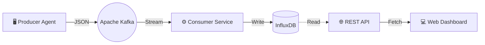

# 🚀 System Insight


**System Insight** est une solution complète de surveillance système (Hardware Monitoring) basée sur une architecture microservices distribuée et résiliente.

Contrairement aux solutions monolithiques classiques, ce projet utilise un **bus d'événements (Apache Kafka)** pour découpler totalement la collecte des métriques de leur analyse, garantissant une haute performance et une tolérance aux pannes.

---

## 📸 Aperçu du Dashboard


*Visualisation en temps réel : Température CPU, Charge système, RAM et Disque via l'interface Web.*

---

## 🏗️ Architecture Technique

Le système est orchestré par Docker Compose et se compose de modules autonomes :

    Producer (Agent) : Collecte les métriques hardware (CPU, RAM, Disque) via la librairie Oshi et les publie dans Kafka avec une clé de partitionnement (hostname).

    Apache Kafka : Agit comme tampon (buffer) pour absorber les pics de charge et garantir l'ordre des données par machine.

    Consumer : Service Java pur qui consomme les flux en temps réel, désérialise les données JSON et les stocke dans une base de données Time-Series.

    InfluxDB : Base de données optimisée pour le stockage temporel haute fréquence.

    Web Dashboard : Interface responsive (Bootstrap/Chart.js) pour la visualisation des alertes et graphiques.

    


🚀 Installation Rapide (Quick Start)

L'intégralité de la stack (Kafka, Zookeeper, InfluxDB, Services Java) est conteneurisée. Vous n'avez besoin que de Docker sur votre machine.
1. Cloner le projet
```Bash

git clone https://github.com/Nexiros559/projet-annuel.git
cd projet-annuel
```

2. Lancer la Stack

Utilisez Docker Compose pour construire et lancer tous les services en une commande :
```Bash

docker compose -f docker-compose.prod.yml up -d
```

L'initialisation peut prendre environ 30 secondes le temps que Kafka et InfluxDB soient opérationnels.
3. Accéder au Dashboard

Ouvrez votre navigateur sur :

👉 http://localhost:8080/index.html
✨ Fonctionnalités Clés

    Architecture Event-Driven : Utilisation de Kafka pour une scalabilité horizontale.

    Monitoring Temps Réel : Latence minime entre la collecte et l'affichage.

    Partitionnement Sémantique : Garantie de l'ordre des messages grâce aux clés Kafka (par hostname).

    Robustesse : Gestion automatique des reconnexions et des groupes de consommateurs (Consumer Groups).

    Tests Unitaires : Validation des contrats de données (JSON) et isolation des tests via Mockito.

🛠️ Stack Technologique

    Langage : Java 17

    Messaging : Apache Kafka, Zookeeper

    Base de données : InfluxDB 2.x

    Librairies :

        Oshi (Hardware Info)

        Jackson (Sérialisation JSON)

        Mockito (Tests unitaires)

    Conteneurisation : Docker, Docker Compose

    Frontend : HTML5, Bootstrap 5, Chart.js

👤 Auteur

Nexiros - Étudiant en Architecture Informatique
